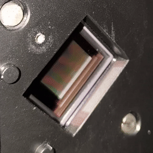

# alp4

This is a reasonably pythonic wrapper of [Vialux](vialux.de)'s ALP-4 API for controlling Digital Micromirror Devices (DMDs) with their control boards.
This package can find ALP-4 installations with no additional setup, and can clean up all resources automatically. You should never need to worry about making sure "free" and "close" are called, even in the event of an error.
The core functionality of the API is implemented - this wrapper is a fundamental part of the system I use for transmission matrix and wavefront shaping research, and it is certainly sufficient for that.

## Example

This example displays a circle, waits for user input, displays a square, waits again, and then terminates.

```python
from alp4 import Alp, AlpDataFormat
import numpy as np


# Library can be specified if not in a sane location, but usually not needed.
alp = Alp()

with alp.open_device() as dmd:
    dmd_size = dmd.get_display_size()
    dmd_width, dmd_height = dmd_size

    print(f"Found DMD of size {dmd_width}x{dmd_height}")

    # Set up coordinates with (0, 0) in the middle
    x, y = np.meshgrid(*( np.arange(n)-n//2 for n in dmd_size ))
    
    # Generate an image with a circle and an image with a square
    circle = np.hypot(x, y) < min(dmd_size)/4
    square = np.maximum(np.abs(x), np.abs(y)) < min(dmd_size)/4

    with dmd.allocate_sequence(1, 1) as seq:
        # Upload the 1st image as a simple one-byte-per-pixel array
        seq.set_format(AlpDataFormat.LSB_ALIGN)
        seq.set_timing(picture = 1_000_000)     # 10^6 us = 1 second
        seq.put(0, 1, circle)                   # Upload 1 image at the start
        seq.start(continuous = True)            # Run indefinitely

        input("Projecting 1st image - enter anything to move to 2nd image")

        # An AlpError will be raised if we try to upload without halting first
        dmd.halt()

        # Upload the 2nd image with each pixel as one bit, packed into a
        # smaller array of bytes (1/8th of the size!)
        seq.set_format(AlpDataFormat.BINARY_TOPDOWN)
        seq.put(0, 1, np.packbits(square, axis = -1))
        seq.start(continuous = True)

        input("Projecting 2nd image - enter anything to stop")

# Done! No explicit clean-up needed, because the with-statements handle it all.
# Explicit halt/free/close calls can be made if not using a context manager.
```



This produces the result shown on the right!

If you don't like having to nest multiple with-statements, you can use python's
built-in `ExitStack`. This is especially useful if you're using other libraries that
also want you to use with-statement context management. An `ExitStack` lets you reduce
all of that down to just 1 with-statement.

## Requirements

* You have an ALP-4 installation
* You have a Vialux DMD kit
* These things work together (test with ALP Demo/EasyProj/supplied software)
* You are using Python 3

## Installation

Download this project directory and put it wherever you will be running your code, so that python can find it and import it successfully.

## Credit

All of the code here was written by me. I used the C header `alp.h` and the PDF documentation supplied with ALP-4.3 to develop this package.
If you use this package in your work, please cite this github repository!
